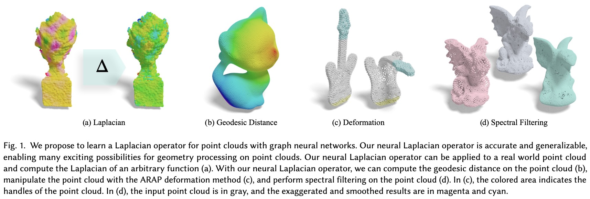

# NeLo: Neural Laplacian Operators on Point Clouds

This work introduces a novel way for Laplacian operator estimation on point clouds.

[**Neural Laplacian Operator for 3D Point Clouds**](https://arxiv.org/abs/2409.06506) <br/>
[Bo Pang](https://github.com/skinboC), [Zhongtian Zheng](https://github.com/zzttzz), Yilong Li, [Guoping Wang](https://cs.pku.edu.cn/info/1230/2021.htm), and [Peng-Shuai Wang](https://wang-ps.github.io/) <br/>
ACM Transactions on Graphics (SIGGRAPH Asia), 43(6), 2024




- [NeLo: Neural Laplacian Operators on Point Clouds](#nelo-neural-laplacian-operators-on-point-clouds)
  - [1. Environment](#1-environment)
  - [2. Dataset](#2-dataset)
  - [3. Training](#3-training)
  - [4. Inference](#4-inference)
  - [5. Citation](#5-citation)

We will continue to optimize & update this repo in the future. TODO list:

- [ ] Rename the confusing class name "graphtree" to "h_graph", and clean the legacy code in that class

- [x] Clean the unncessary configs

- [ ] Check the installation script, specify the version of pyg

- [ ] Upload the code of applications of Laplacian (eigen-decompose, laplaician smoothing, etc.)

- [ ] Upload a checkpoint trained on more categories of ShapeNet

- [x] Reoriginaze the data-preparing code

## 1. Environment

We test the code in Ubuntu 22.04 with pytorch 2.3. The model was trained on 4x4090 GPUs, but it should be OK to do inference with a 1060 GPU.

To run the code, first, please install pytorch that fits your cuda version.

Then:

```python
conda install pyg -c pyg

bash install_requirements.sh
```

## 2. Dataset

We provide the script of generating training data (Section 4.1 in the paper). Please put the mesh you want to process in `raw_data` folder. Then run:

```bash
cd src/data_prepare

python generate_processed_mesh.py
```

You will see the processed mesh in `processed_data` folder.

## 3. Training

Before training, you may want to specifiy some hyperparamters. You can open `config/global_config.py` and modify the training settings. Most paramters in that file are self-explainary.

To train the model:

```bash
python main.py --config config/global_config.py
```

A pretrained checkpoint is provided on [Google Drive](https://drive.google.com/file/d/1nHOTlJb_CFobOHN2MP9f8ILfoUkOg3hJ/view?usp=drive_link). Please put it in `out/checkpoints`. It was trained on a subset of ShapeNet objects. As a deep-learning based method, it may not generalize well on categories very different from the training set.

## 4. Inference

We provide three simple script to visualize the result of our method on different shapes. You can run any of the three scripts to see the result.

```bash
bash script/test_on_desk.sh

# or test_on_chair.sh, test_on_plane.sh
```

After this, there should be 3 browser tabs opened, visualizing $L_{ours}f$, $L_{robust} f$, $L_{gt}f$ (ours, [Sharp and Crane 2020], and ground truth), where $f$ is the 48th eigenvector of the input shape.


## 5. Citation

If you find this project useful for your research, please kindly cite our paper:

```
@article{pang2024neural,
  title={Neural Laplacian Operator for 3D Point Clouds},
  author={Pang, Bo and Zheng, Zhongtian and Li, Yilong and Wang, Guoping and Wang, Peng-Shuai},
  journal={ACM Transactions on Graphics (SIGGRAPH Asia)},
  year={2024}
}
```

If you have any questions, please feel free to contact us at bo98@stu.pku.edu.cn
